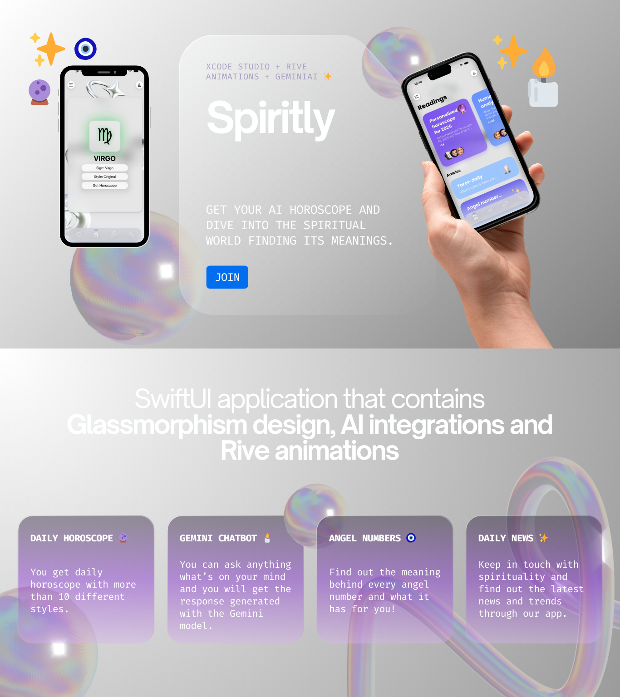

# ✨ Spiritly

> Get your AI horoscope and dive into the spiritual world — finding its meanings.



---

## 🔮 About

**Spiritly** is a SwiftUI iOS application that blends spirituality with modern technology. It features a stunning **Glassmorphism** design, smooth **Rive animations**, and AI-powered content through the **Gemini 2.0 Flash** model.

---

## 🛠️ Tech Stack

- **SwiftUI** — iOS native UI framework
- **Rive Animations** — smooth, interactive animations
- **Gemini AI (2.0 Flash)** — AI-powered horoscope and chatbot
- **Xcode Studio** — development environment

---

## ✨ Features

### 🌟 Daily Horoscope
Get a personalized daily horoscope generated by Gemini AI in more than 10 different styles:
- Sad, Happy, Realistic, Optimistic, Pessimistic, and more
- Choose your zodiac sign and your preferred style
- Fresh horoscope generated every day

### 🤖 Gemini Chatbot
- Ask anything on your mind
- Get intelligent, thoughtful responses powered by the Gemini model
- Your personal spiritual AI assistant

### 🔢 Angel Numbers
- Browse a grid of angel numbers
- Tap any number to discover its spiritual meaning
- Beautiful, immersive detail view for each number

### 📰 Daily News & Trends
- Stay in touch with spirituality
- Read the latest articles, news, and trends
- Everything in one place

---

## 🎨 Design

Spiritly features a carefully crafted **Glassmorphism** aesthetic with layered transparencies, soft blur effects, and a refined color palette — creating an immersive and calming spiritual experience.

---

## 🚀 Getting Started

### Prerequisites
- Xcode 15+
- iOS 17+
- Gemini API Key

### Setup
1. Clone the repository
```bash
git clone https://github.com/TheWhitePigeon/Spiritly.git
```
2. Open `Spiritly.xcodeproj` in Xcode
3. Add your Gemini API key in the project settings
4. Build and run on simulator or device

---

## 👩‍💻 Author

Built by Zhanet Nikolovska
